# TechHack Roteiro

# 1.1 
### a)
   Encontrar o IP do alvo...

   Para conseguir o IP do alvo, é necessário conectar as duas VMS em uma mesma rede. 
   Dessa forma, utiliza-se o seguinte comando para saber qual sub-rede as duas máquinas estão conectadas. 

   ```bash 
   $ ifconfig 
   ```
   Depois de rodar este comando na máquina do atacante, descobre-se que a sub-rede em que ambos as máquinas estão ligadas é /24 . Já que a máscara encontrada é 255.255.255.0

   Com isso é possível utilizar outro comando que será responsável por mostrar todos os IPs dentro dessa sub-rede /24. 

   ```bash 
   $ netdiscover -r 192.168.0.0/24
   ```

Com a captura de tela do comando, é possível ver quantos endereços IPS estão conectados nesta sub-rede :
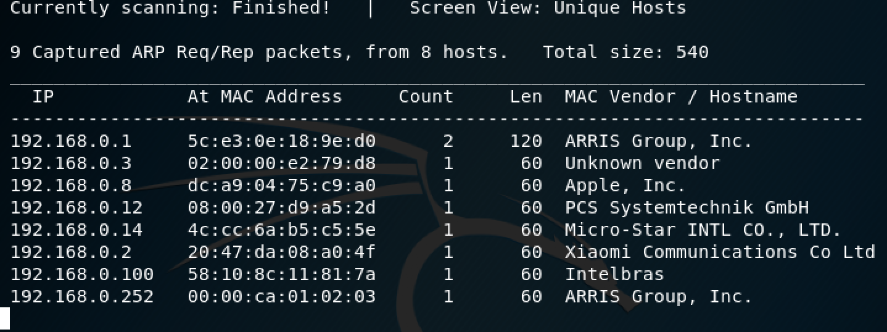

Dentro da sub-red todos os Vendors são normais como computadores, celulares tabletes etc, porém ao analisar *PCS systemtechnik GmbH* percebe-se que o alvo possivelmente é este HostName. 
    Assim pega-se o IP deste endereço:
    
     IP do alvo: 192.168.0.12   


### b)

Descobrir qual a versão do sistema operacional do alvo, qual é este sistema e em qual porta este processo está rodando.

Com o IP conseguido anteriormente, **192.168.0.12**, realiza-se uma fase de reconhecimento para conseguir mais informações sobre o alvo em questão.

Com o auxílio da ferramenta telnet consegue-se saber todas as informações desejadas para esta etapa utilizando o comando:

```bash 
   $ telnet 192.168.0.12 21
```

O Telnet nos dirá um pouco mais sobre o IP que está sendo analisado, enquanto o 21 depois significa que realizamos uma conexão com a porta ftp do alvo. Esta porta é extremamente vulnerável devido ao fato do protocolo ftp apresentar vulnerabilidades altas comparadas com o http. 

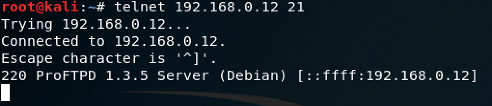

Com isso conseguimos :

- Porta que este processo está rodando: 220
- O nome : ProFTPD
- Versão do sistema operacional : 1.3.5 Server (Debian)


### c)

Vamos continuar buscando mais informações sobre o alvo, dessa vez, iremos utlizar o commando **nmap** com o objetivo de descobrir exatamente quais portas do alvo estão abertas para podermos realizar algum tipo de inspeção.

Assim, ao utilizar :

```bash 
   $ nmap -A 192.168.0.12
```
Tem-se a possibilidade de obter mais informações sobre o alvo. 
Este comando é realmente muito poderoso e da muita flexibilidade pro atacante vide o leque de infos que ele adquiriu. A foto abaixo mostra os resultados do comando : 

Primeira foto mostra as portas que estão operando no alvo:


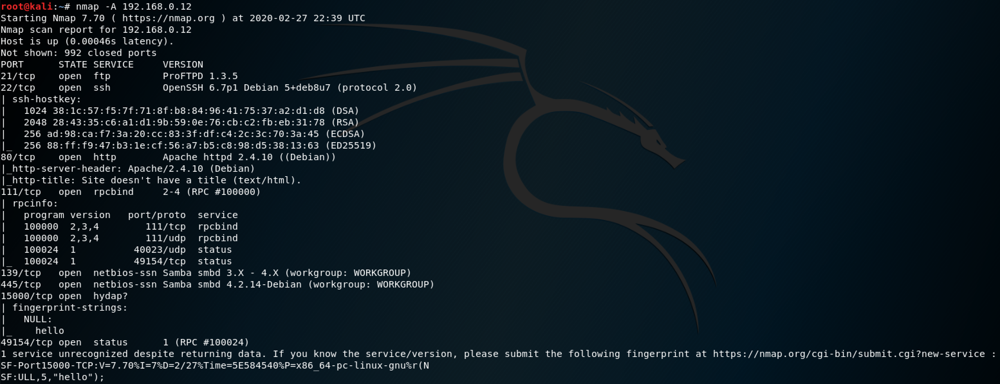

Enquanto a segunda mostra coisas como versão do Host, MAC address versão do kernel utilizado entre outros:


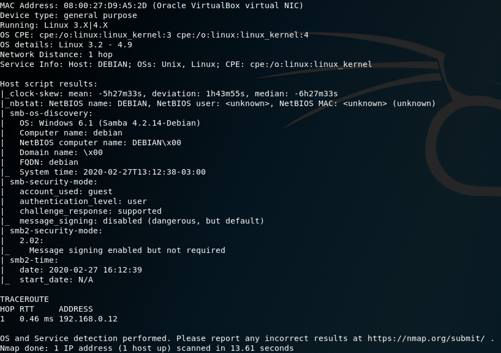


### d)

Para finalizar esta etapa foi necessário desenvolver um app simples de escaneamento de portas em um certo range de Ips. Isto é, sabendo um alvo, ainda é necessário acessar um IP inicial e um IP final e verificar as portas do alvo neste meio. Além disso, escolhe-se a porta para realizar a socket na linha de comando, assim como o IP do alvo. Dessa forma, ao rodar o programa teremos 3 argumentos:
- scrappyScanner.py
- Ip alvo (192.168.0.12)
- 80 (porta socket)

Depois disso, o programa pedirá para colocar um IP inicial e um IP final, assim como uma porta inicial e uma porta final para serem varridas.

 ```python
import logging  
logging.getLogger("scapy.runtime").setLevel(logging.ERROR)

import sys

import socket

from scapy.all import *

import ipaddress


if len(sys.argv) != 4:
    print("Uso: %s alvo portaSocket rede" % (sys.argv[0]))
    print("O range de portas será dado como input do programa")
    sys.exit(0)

alvo = ipaddress.IPv4Address(sys.argv[1])
portaSocket = int(sys.argv[2])
rede = ipaddress.ip_network(sys.argv[3])

portaInicial = int(input("Digite a primeira porta a ser escaneada\n"))
portaFinal = int(input("Digite a última porta a ser escaneada\n"))


tcp = socket.socket(socket.AF_INET, socket.SOCK_STREAM)

tcp.settimeout(5)

destino = (alvo,portaSocket)

print("Escaneando "+ str(alvo) +" para portas TCP\n")

if portaInicial == portaFinal:
    portaFinal += 1

if portaInicial > portaFinal:
    print("Porta final deve ser menor que porta inicial a ser escaneada")
    sys.exit(0)


## Escanear a rede
for ips in rede:
    ## Escanear as portas
    for p in range(portaInicial,portaFinal):
        if tcp.connect_ex((str(alvo),portaSocket)):
            print("The port is closed") 
            
        else:
            print("The port number.{0}",p)
            print(p)

print("Escaneamento completo!")
   ```

### e (faltou)


## Parte 1.2 Roteiro - Análise de comunicação de dados

Nesta segunda parte do roteiro utilizaremos o WireShark, ele é um (sniffer), isto é, consegue analisar diversos protocolos de comunicação entre as máquinas.
A primeira etapa foi criar diversos filtros no WireShark para selecionar apenas os protocolos desejados. Dentre eles:
    
    >  DNS
    >  HTTP
    >  UDP
    >  TCP 
    >  DHCP

Fluxo normal no WireShark:

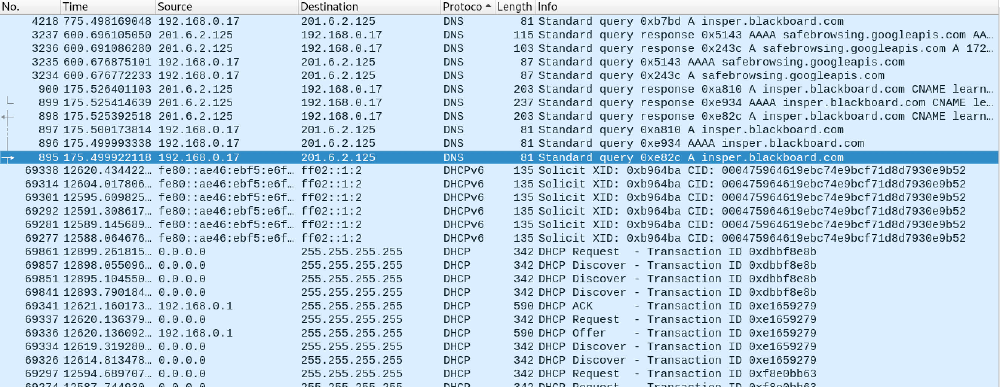


Fluxo com a utilização de um filtro:

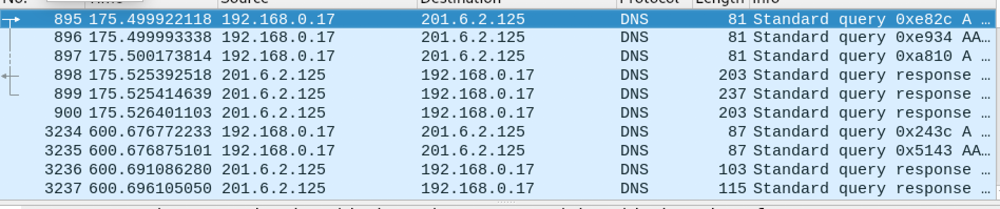

Através do print do fluxo normal do WireShark, é possível observar que existem diversos protocolos que participam na comunicação dos computadores dentro de uma rede. Portanto, quando desejamos encontrar denominada informação como o domínio de uma aplicação, por exemplo, pega-se o filtro DNS e procura-se informações a respeito do mesmo analisando estes pacotes. Por meio da teoria por trás do modelo TCP/IP, com esse filtro ainda precisamos lembrar que, se a conexão não for UDP, ela terá um pacote de resposta. No caso do DNS, este pacote de resposta mostrará exatamente o domínio desta aplicação. 

# 1.2 

### a) Encontrando Host Names, Ips e Mac Address.

Por meio do arquivo dado  "exercício análise trafego1.pcap" nossa primeira tarefa é de descobrir os 3 hosts names, IPs e MAC ADDRESS das 3 máquinas Windows. Para descobrir um IP deve-se lembrar quais protocolos conversam diretamente com o roteador para sabermos quais pacotes devemos buscar neste exercício. Neste caso, podemos analisar os pacotes DHCP, pois eles são os responsáveis por automaticamente atrelar um IP a uma máquina, lembrando que o DHCP é feito dentro de um roteador. 

Com isso temos o seguinte output após utilizar o filtro do WireShark :

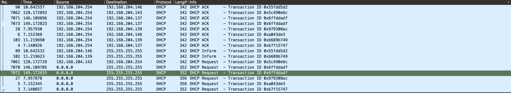

A partir destes resultados, podemos analisar ainda mais a fundo, ao clicar em info, observar quais requests DHCP foram feitos para encontrar os IPS que estão estabelecendo a conexão. 

Este print nos da uma ideia do broadcast, já que o endereço destino é 255.255.255.255. Ou seja, os dispositivos mandam um sinal desejando se conectar na rede, com isso o roteador, por meio do DHCP, analisa esta requisição, e responde para o dispositivo caso a conexão foi feita com sucesso. Assim, ao observar o (Dynamic Host Configuration Protocol) deste pacote em verde na imagem acima, é possível descobrir o IP, o MAC-ADDRESS e o host name das três máquinas Windowns.

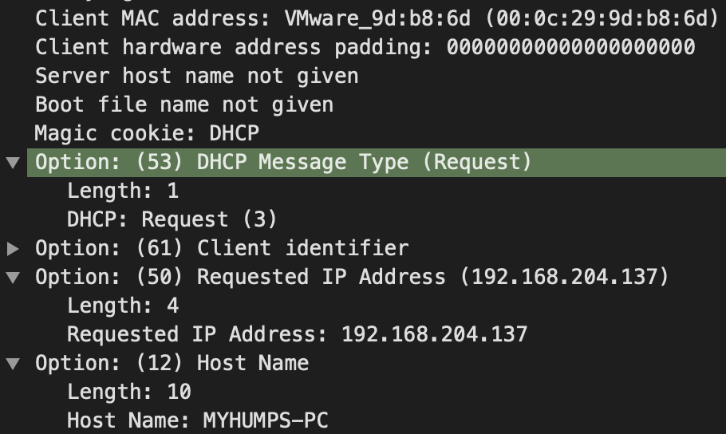

Dessa forma, descobrimos os seguintes nomes de Hosts, Ips e Mac-Address.

    #Primeira Máquina    

    Host Name: ROCKETMAN-PC

    IP : 192.168.204.139

    MAC-ADDRESS : 00:0c:29:61:c1:89

    #Segunda Máquina

    Host Name : MYHUMPS-PC

    IP : 192.168.204.137

    MAC-ADDRESS: 00:0c:29:9d:b8:6d


    #Terceira Máquina

    Host Name : WORKSTATION6

    IP : 192.168.204.146

    MAC-ADDRESS: 00:0c:29:fc:bc:2e

b) Encontrando Host Names, IPS dos invasores.

Dado que uma das máquinas foi atacada, a proposta agora é encontrar o IP que redirecionou alguma ação do cliente para o malware em questão. 

A partir do enunciado, sabe-se que houve um redirecionamento de fato. Ou seja, ao analisar as respostas http que são entre 300 e 400, pegamos todos os pacotes que foram de fato redirecionados. Com isso, ao analisar todos os pacotes, chegou-se ao que parece ser mais estranho :

    Filtro: 300 <http.response.code <400
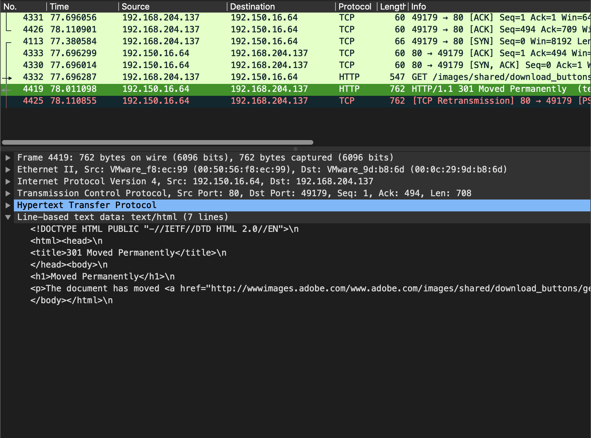


A partir do print, pode-se concluir que todos estes pacotes foram redirecionados, ao olhar um por um, chegou-se a conclusão de que a imagem acima mostra algo estranho. Ele diz que a página foi redirecionada permanentemente para uma URL suspeita. Dessa forma, ao clicar no pacote selecionado em verde na imagem, pode-se seguir este pacote por meio de um fluxo de TCP, obtendo o seguinte resultado: 

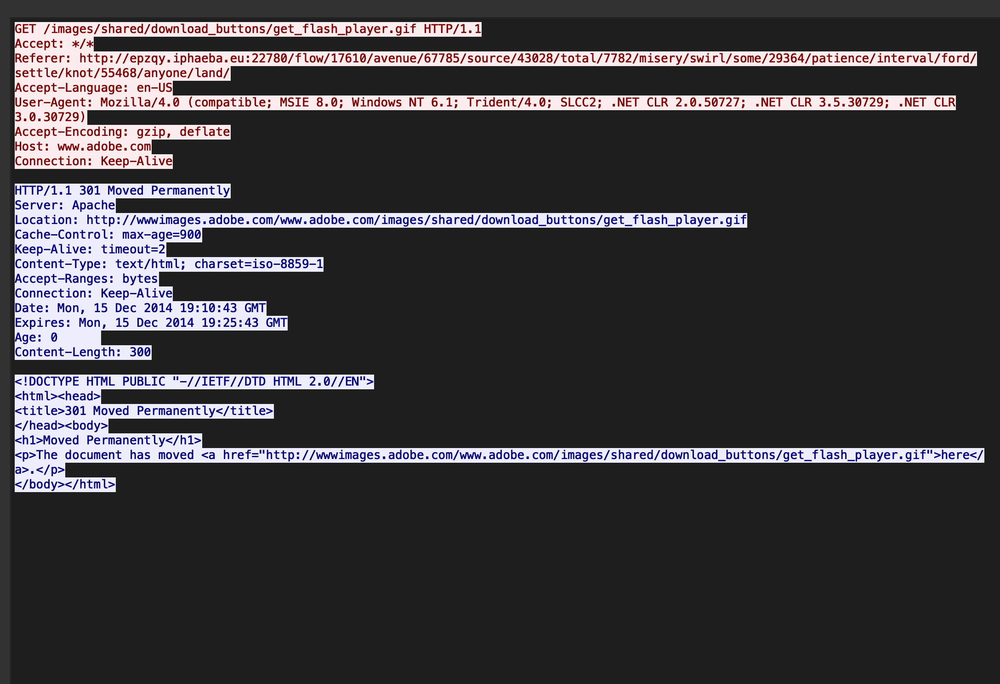

Interpretando este output, percebe-se na primeira linha que ele tenta dar um GET em um diretório específico chamado /images/shared/download_buttons/get_flash_player.gif HTTP/1.1
Entretanto, o comportamento estranho está nítido quando este método GET não deveria ser redirecionado para este link :

    http://epzqy.iphaeba.eu:22780/flow/17610/avenue/67785/source/43028/total/7782/misery/swirl/some/29364/patience/interval/ford/settle/knot/55468/anyone/land/


Dessa forma, concluí-se que o IP que está sendo atacado em questão é : 192.168.204.137. 
A fonte do ataque segundo nossas análises é dita pelo IP 192.150.16.64.
O tipo de ataque neste caso também envolve engenharia social, já que de alguma forma o atacante está tentando enganar o usuário com uma possível imagem que seja verdadeira. No entanto, quando o usuário cair neste click o atacante já terá redirecionado o mesmo para uma URL maliciosa. 

### c) 

Nosso próximo passo é identificar qual domínio este site que foi atacado pertence. Para isso utilizaremos o filtro com o seguinte comando: 

    ip.addr == 192.168.204.137 && dns

Com isso, podemos saber o tráfego deste IP e especificamente os pacotes de DNS que esta conexão está tratando. 

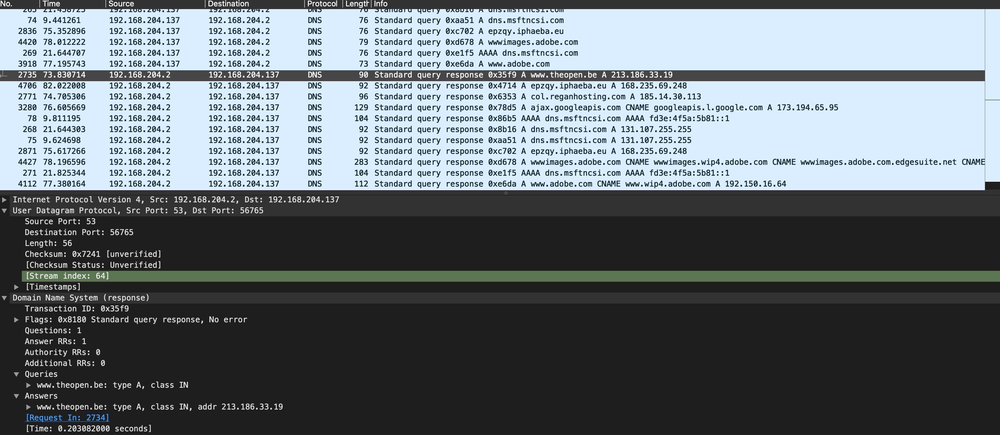

Ao clicar no primeiro pacote direcionado ao nosso alvo pode-se encontrar seu domínio nas respostas que este pacote nos fornece, neste caso o domínio é o www.theopen.be

### d)

O site comprometido foi encontrado na segunda etapa. 

    Alvo: 192.168.204.137


### e) 
O site que serviu de intermediário para que o usuário caísse neste golpe foi o site do Adobe, entretanto o real responsável pelo direcionamento foi o site:
    
    www.theopen.be

    http://wwwimages.adobe.com/www.adobe.com/images/shared/download_buttons/get_flash_player.gif

### f)
Este IP também foi encontrado na segunda etapa:

    Atacante: 192.150.16.64

# 1.3 Adiministração Sistema Operacional GNU/linux

## Esta parte do roteiro é focada em como o sistema operacional linux guarda informações e utiliza sistemas de permissões.

## 1.3 a)

Com a ideia de tentar procurar por algum malware na máquina dada pelo professor, o objetivo foi de escanear cada um dos diretórios dessa máquina.
Dessa forma, procurou-se algum comando que retorna-se algum arquivo ou diretório suspeito. 
    Neste caso, utilizou-se o find. Como não sabia-se a origem do arquivo em toda a estrutura da sistema operacioanl, rodou-se o seguinte comando:

        $ find / 
Porém a saída foi extremamente grande porque não filtramos o que desejamos, a próxima tentativa utilizamos a flag **-type f**. 
        
        $ find / -type f 
Novamente, não nós ajudou muito... A saída continuou muito grande.

Assim teve-se que pensar mais um pouco para encontrar arquivos que tenham algo de diferente em relação aos outros. Por isso considerou-se a permissão que cada um deles possui. Com este filtro de permissão foi possível encontrar o possível malware. 

    $ find / -perm 0777 -type f

Com isso, a saída foi a seguinte : 

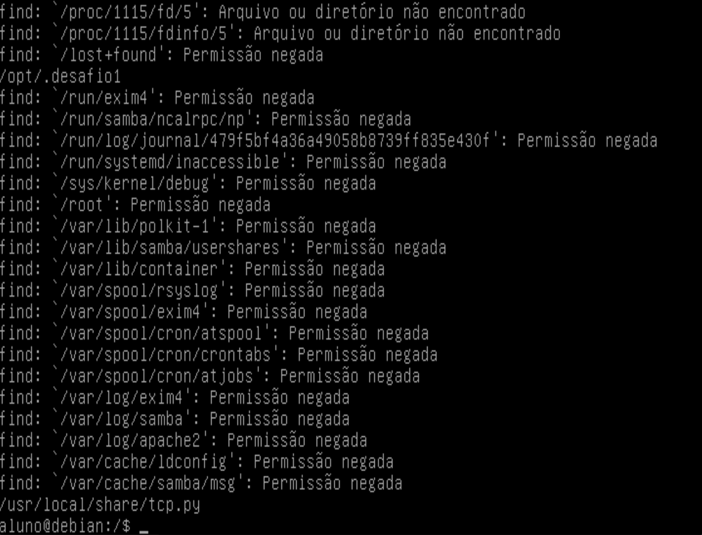

Com isso encontrou-se um executável ocultado dentro da pasta /opt/. Ou seja, caso eu desse o seguinte comando :
    
    $ cd /opt
    $ ls -a 

Dessa forma, o -a nós mostrará o arquivo oculto executável: 
    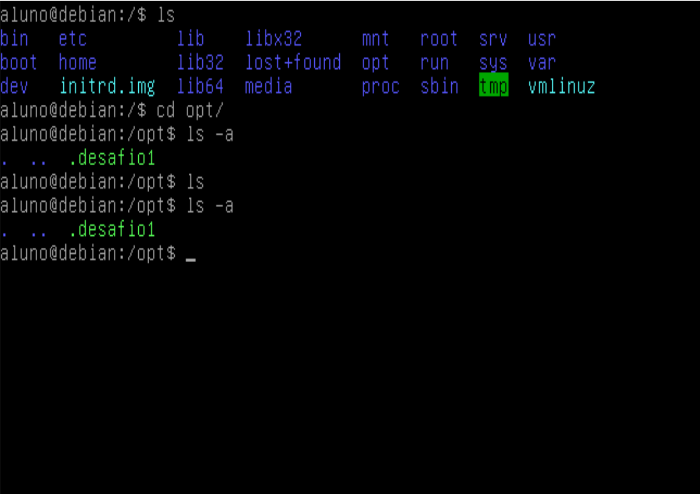

Que ao rodarmos da pasta home, temos que o desafio 1 foi concluído:

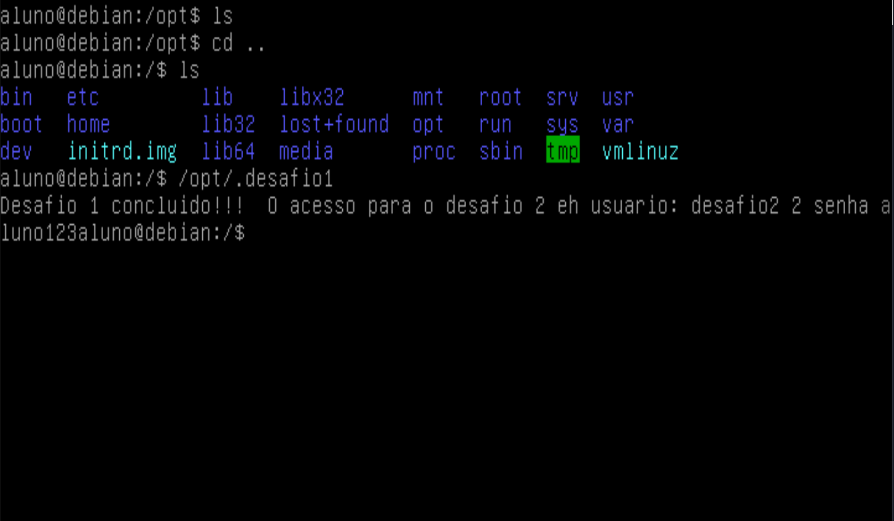

## 1  b) PASS


## 1 c) Encontrando um processo malicioso

Nossa próxima etapa será descobrir um processo malicioso que está rodando na máquina de forma despercebida. 
Para checar os processos utilizamos o comando :
    
    $ ps aux

O ideal para este parte foi verificar o manual do ps pois ele tem muitas opcões, assim : 

    $ man ps

Seguindo a lógica de permissões do item a, a primeira filtragem será para ver processos que possuem permissões elevadas. Assim vamos utilizar o comando do ps que observa os processos do root.

    $ ps -U root -u  

Encontra-se um processo python rodando de forma suspeita com a permissão de root. 

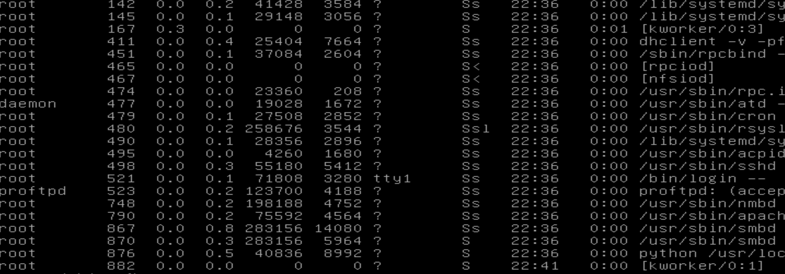

Agora o passo necessário é encontrar em qual porta este processo está rodando, por mais que o caminho da origem deste arquivo esteja cortado, ele está na seguinte pasta:

    /usr/local/share/tcp.py


Dando o comando cat neste arquivo:
    
    $ cat usr/local/share/tcp.py

Podemos ver que ele estabelece uma conexão tcp utilizando a porta 15000: 
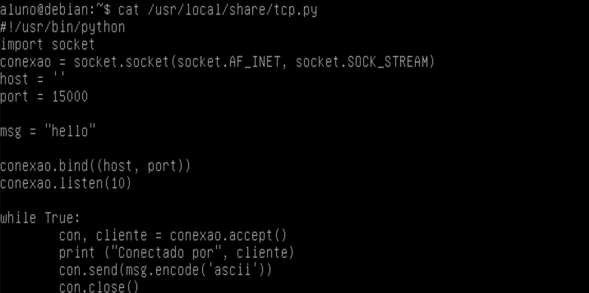


Dessa forma este código utiliza a porta 15000 para conseguir se conectar com a máquina. É importante ressaltar que está é uma porta não tão comunm de ser utilizada, o que levanta ainda mais suspeitas sobre o código malicioso. O código em questão manda uma mensagem de "Hello" para um serviço em que ele se conectou. Além disso vale pontuar que a conexão criada é TCP como o próprio arquivo. 

# 1.4 Encriptação do Debian jessie.

### Objetivo: Encriptar o Debian 8.0 do zero dividindo todo o HD em 3 partições principais:


|Id partições   |Nome partições   |Encriptada| Espaço disco    | 
|---            |---              |---       | ---             |
|1              | /boot           |   não    |  500MB               |  
|2              | /var            |   sim    |   4GB              | 
|3              | /root           |   sim    |   4GB              | 

A primeira partição */boot* contém os arquivos do sistema de boot. Portanto não devemos encriptá-los, se não o sistema iria crashar na hora do boot pois seus arquivos estariam encriptados.   
A segunda partição representa um usuário comum no nosso sistema. Ele deve ser encriptado e possuir uma senha. Entretanto, suas permissões não são totais como no */root*. Contendo assim uma senha diferente da nossa terceira partição. 
Finalmente temos a partição raiz */root*, ela é basicamente a partição que um hacker gostaria de invadir, vide o fato de possuir permissões totais para alterar, deletar arquivos importantes. Ela deve com certeza ser encriptada e possuir uma senha diferente da nossa segunda partição */var*.  

